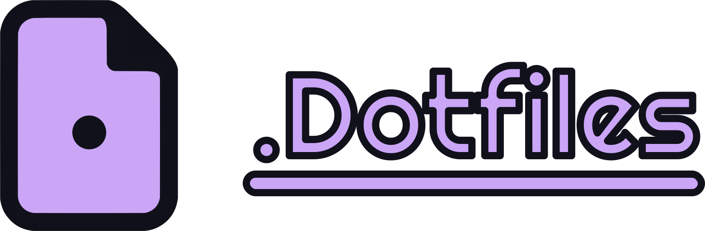

# Dotfiles

Bem-vindo ao meu repositório pessoal de dotfiles! Essa coleção de dotfiles contém os arquivos de configuração de várias ferramentas e aplicativos que utilizo diariamente. Ao versionar esses arquivos com o Git, posso facilmente sincronizar minhas configurações em várias máquinas e configurar rapidamente novos ambientes.

## Sumário

- [Dotfiles](#dotfiles)
  - [Sumário](#sumário)
  - [Exposições](#exposições)
  - [Introdução](#introdução)
  - [Instalação](#instalação)
  - [Utilização](#utilização)
  - [Estrutura](#estrutura)
  - [Customização](#customização)
  - [Contribuições](#contribuições)
  - [Licença](#licença)
  - [Agradecimentos](#agradecimentos)

## Exposições

## Introdução

Dotfiles são arquivos de configuração ocultos que geralmente são armazenados no diretório home do usuário (`~`, `$HOME`, `/home/<username>`). Eles controlam o comportamento e a aparência de aplicativos de software, shells e outras ferramentas. Este repositório fornece um local central para armazenar e gerenciar esses dotfiles, facilitando a manutenção de uma configuração consistente em diferentes máquinas.

## Instalação

Estou trabalhando nisso atualmente.

## Utilização

Uma vez instalados os dotfiles, você pode facilmente atualizar suas configurações ou adicionar novas modificando os arquivos correspondentes no diretório `~/.dotfiles`. As alterações serão automaticamente refletidas em seu sistema.

Vale ressaltar que alguns dotfiles podem exigir que você reinicie o aplicativo ou shell correspondente para que as alterações tenham efeito.

Você também pode adicionar scripts ou instaladores adicionais no diretório `~/.dotfiles` para automatizar a configuração de outras ferramentas ou aplicativos. Sinta-se à vontade para explorar os arquivos e diretórios existentes para entender melhor as configurações disponíveis.

## Estrutura

O repositório está organizado da seguinte forma:

- `apps/`: Esta pasta contém todas as ferramentas de escopo do usuário.
- `system/`: Esta pasta contém todas as ferramentas do sistema.
- `assets/`: Esta pasta contém todos os ativos ou arquivos não essenciais.
- `LICENSE`: O arquivo de licença MIT.
- `CODE_OF_CONDUCT.md`: O arquivo de Código de Conduta do Contribuidor.
- `CONTRIBUTING.md`: O arquivo que explica como contribuir.
- `README.md`: O arquivo que você está lendo atualmente.
- `README_BR.md`: A versão em português brasileiro deste arquivo.

Sinta-se à vontade para modificar a estrutura de acordo com suas preferências ou necessidades específicas. Você pode adicionar ou remover diretórios e arquivos conforme necessário.

## Customização

Esses dotfiles servem como ponto de partida, mas você pode personalizá-los de acordo com suas preferências e fluxo de trabalho. Aqui estão algumas maneiras de fazer isso:

- Modificar os dotfiles existentes: Abra os arquivos correspondentes no diretório `~/.dotfiles` e faça as alterações necessárias. Cada arquivo geralmente contém comentários explicando o propósito das opções de configuração.
- Adicionar novos dotfiles: Crie um novo arquivo no diretório apropriado ou crie um novo diretório. Certifique-se de atualizar o script de instalação para criar links simbólicos dos novos dotfiles nos locais apropriados.

Lembre-se de manter suas alterações dentro do diretório `~/.dotfiles` para manter a portabilidade e facilitar a sincronização em diferentes máquinas.

## Contribuições

Contribuições, melhorias e sugestões são sempre bem-vindas! Se encontrar algum problema ou tiver ideias para aprimorar esses dotfiles, sinta-se à vontade para abrir uma issue ou enviar uma solicitação de pull.

Se deseja contribuir, consulte [CONTRIBUTING](./CONTRIBUTING.md) para mais detalhes.

Por favor, tenha paciência durante o processo de revisão, pois pode levar algum tempo para abordar e incorporar suas contribuições.

## Licença

Este repositório está licenciado sob a [Licença do MIT](./LICENSE.md). Você está livre para usar, modificar e distribuir o código neste repositório. Consulte o arquivo [LICENSE](./LICENSE.md) para obter mais detalhes.

## Agradecimentos

Gostaria de expressar minha gratidão à comunidade de código aberto pelas inúmeras inspirações e recursos que ajudaram a moldar esses dotfiles. Além disso, quero agradecer a todos os contribuidores que compartilharam seu conhecimento e expertise, tornando mais fácil para os outros personalizarem e otimizarem suas configurações.

Agradecimentos especiais aos criadores e mantenedores dos seguintes projetos que foram fundamentais no desenvolvimento desses dotfiles:

- [Catppuccin/Catppuccin](https://github.com/catppuccin/catppuccin): O esquema de cores desses dotfiles.
- [r/UnixPorn](https://www.reddit.com/r/unixporn): Pela ajuda em alguns problemas técnicos e inspirações.
- [adi1090x/rofi](https://github.com/adi1090x/rofi): Os temas usados no ROFI.
- [elkowar/eww](https://github.com/elkowar/eww): Os widgets.

Suas contribuições e feedbacks são muito apreciadas!
