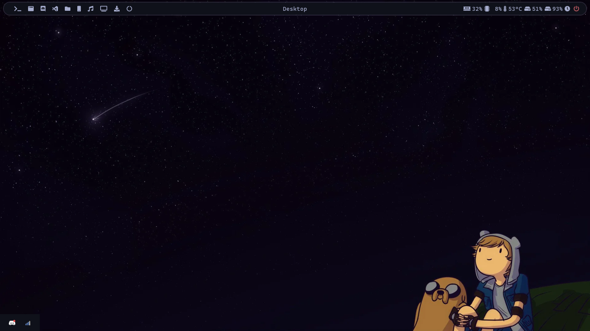
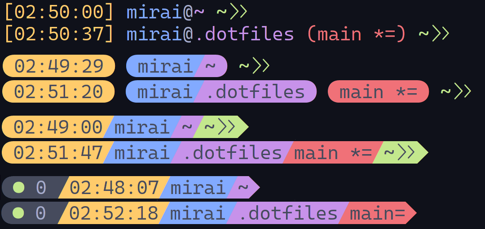
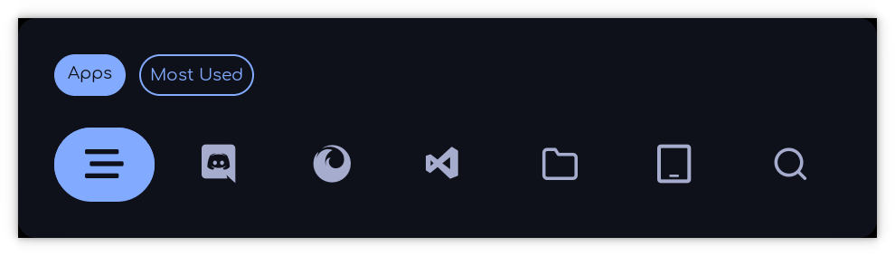
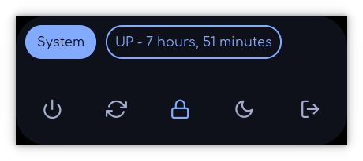

# .dotfiles

These are my .dotfiles :]

If you don't know, .dotfiles are basically configurations files in unix-like systems

### Packages

- https://github.com/gitGNU/gnu_bash or https://github.com/zsh-users/zsh
- https://github.com/ibhagwan/picom
- https://github.com/Airblader/i3
- https://github.com/dylanaraps/neofetch
- https://github.com/polybar/polybar
- https://github.com/davatorium/rofi
- https://github.com/adi1090x/rofi
- https://github.com/gnome-terminator/terminator
- https://github.com/Swordfish90/cool-retro-term
- https://github.com/vim/vim
- https://github.com/Peltoche/lsd
- https://github.com/tadly/hideIt.sh

### [Color Schemes](https://github.com/MiraiMindz/vim-colorschemes-collection)

https://github.com/MiraiMindz/vim-colorschemes-collection

    
Images and Videos

    <h4>Desktop</h4>
    
    <h4>BASH Prompts</h4>
    
    <h4>ZSH Prompts</h4>
    
    <h4>Rofi Applets and Menus [WIP]</h4>
    
    
    <h4>Firefox Startpage</h4>
    <video width="1280" height="720" controls>
        <source src="./sources/Videos/FirefoxStartpage.mp4" type="video/mp4">
    </video>
    <h4>Cool Retro Term Change Color Script</h4>
    <video width="1280" height="720" controls>
        <source src="./sources/Videos/cool-retro-term_ChangeColor.mp4" type="video/mp4">
    </video>

